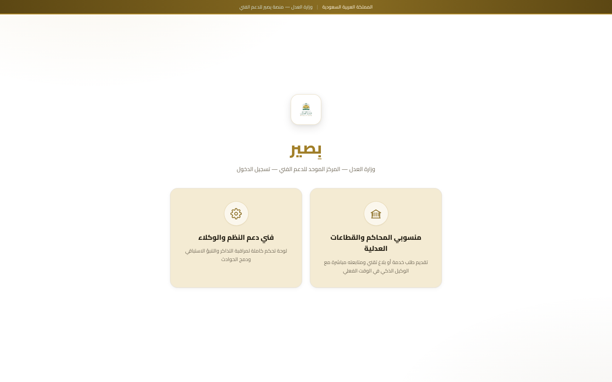
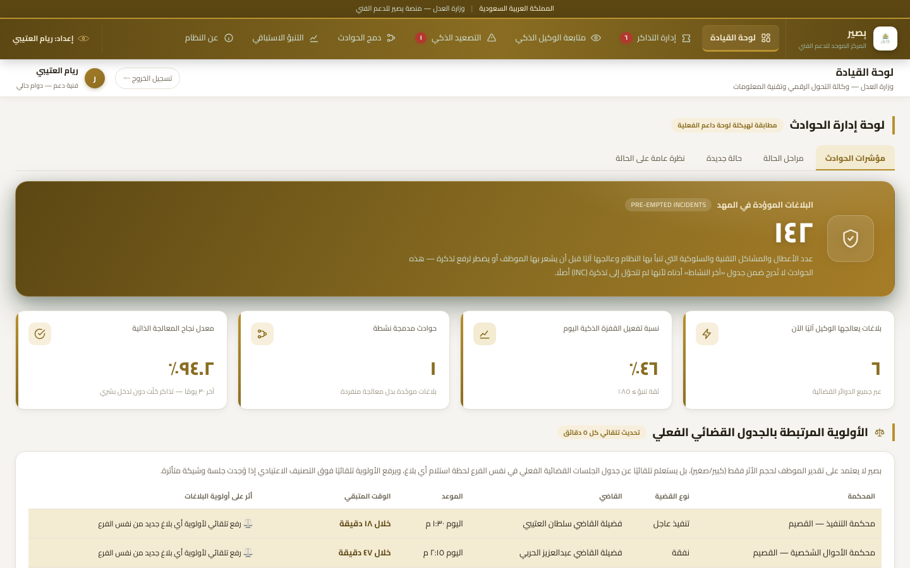
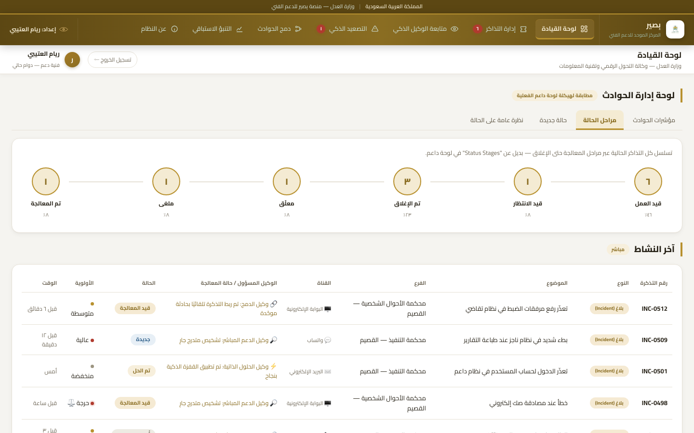
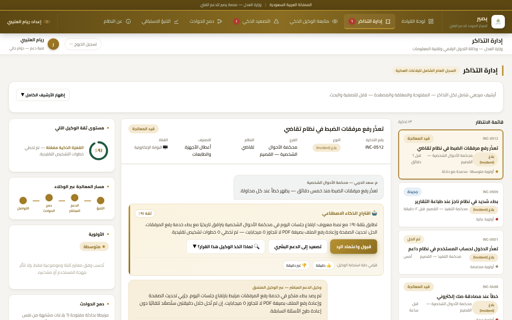
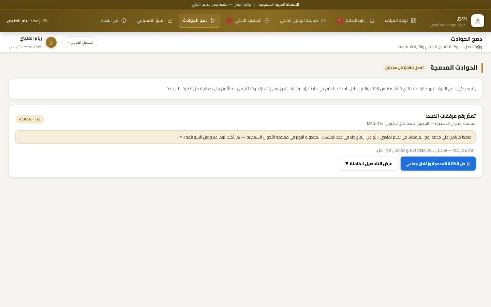
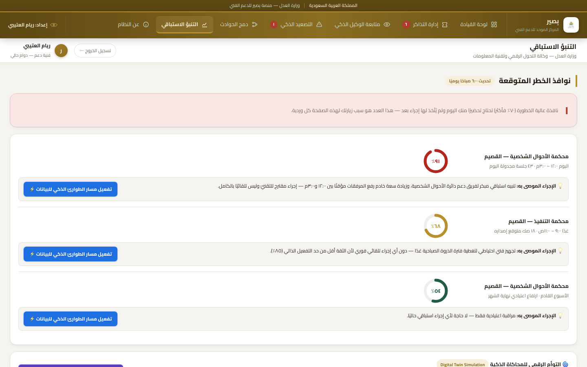
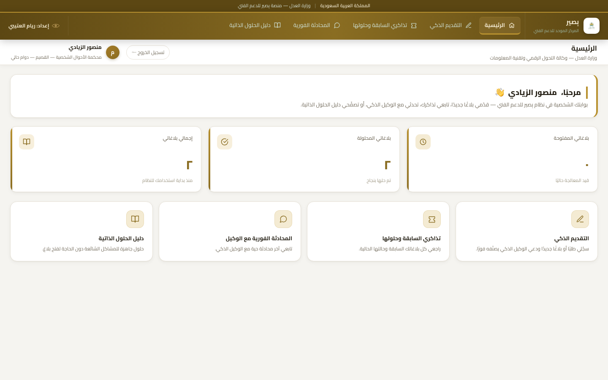
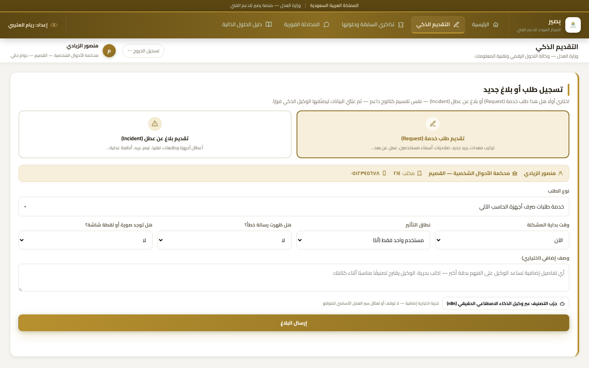
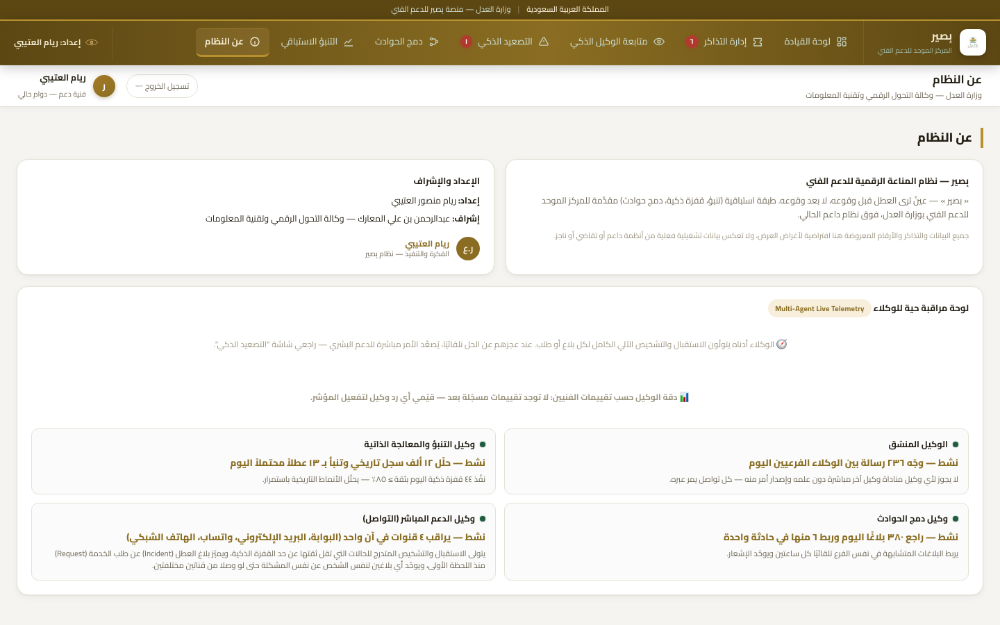

<div dir="rtl">

# بِصير — نظام دعم فني ذكي | وزارة العدل

بِصير نموذج أولي لمنصة دعم فني تعتمد على الذكاء الاصطناعي، مصمّم لتطوير كفاءة نظام "داعم" (القائم على ServiceNow) في وزارة العدل، عبر طبقة استباقية تجمع بين التنبؤ بالأعطال، التصنيف الذكي للتذاكر، والتنفيذ الفوري للحلول عالية الثقة.

الموقع المباشر: https://ryam-alotaibi.github.io/Basir-AI-Prototype/

ملاحظة: جميع البيانات والتذاكر والأرقام المعروضة في هذا النموذج افتراضية لأغراض العرض التوضيحي، ولا تعكس بيانات تشغيلية فعلية من أي نظام حقيقي بوزارة العدل.

---

## نظرة عامة

المشروع مقدَّم كواجهتين ضمن نفس المنصة: واجهة فني الدعم (لوحة قيادة كاملة لإدارة التذاكر ومراقبة الوكيل الذكي)، وواجهة الموظف المستفيد (بوابة لتقديم البلاغات ومتابعتها والتفاعل مع الوكيل الذكي مباشرة).

## الأهداف

1. تحليل الوضع الحالي لنظام "داعم" وتحديد التحديات (الاعتماد الكبير على التدخل البشري في فرز التذاكر، طول مدة الاستجابة للحالات الحرجة، غياب نظام تنبؤي).
2. اقتراح حلول تقنية قائمة على الأتمتة والذكاء الاصطناعي لتحسين سير العمل.
3. تطوير نماذج ذكية للتنبؤ بالأعطال وإدارة التذاكر بكفاءة أعلى.
4. تعزيز تجربة المستخدم ورفع مستوى رضا المستفيدين.
5. تطوير إجراءات لإدارة الحوادث الحرجة تضمن استمرارية الأعمال.

## الميزات

**للفني:**
- لوحة قيادة تفاعلية بمؤشرات حوادث حيّة وتسلسل مراحل معالجة التذاكر.
- إدارة تذاكر شاملة: قائمة انتظار، مساحة عمل لكل تذكرة، اقتراحات ذكاء اصطناعي بنسبة ثقة، أرشيف قابل للبحث.
- القفزة الذكية: تنفيذ تلقائي للحلول عالية الثقة (٨٥٪ فأكثر) دون تدخل بشري.
- التصعيد الذكي ودمج الحوادث المتكررة في حادثة موحّدة.
- التنبؤ الاستباقي مع توأم رقمي لمحاكاة الضغط التشغيلي قبل بدء الأسبوع.
- لوحة مراقبة حيّة متعددة الوكلاء.

**للموظف:**
- تقديم بلاغ أو طلب موحّد، مع اقتراح تصنيف تلقائي أثناء الكتابة.
- تصنيف حي بذكاء اصطناعي فعلي عبر وكيل مبني على n8n وOpenAI — التعليمات في [تعليمات_تشغيل_n8n.md](تعليمات_تشغيل_n8n.md).
- متابعة التذاكر السابقة وحلولها، ومحادثة فورية مع الوكيل، ودليل حلول ذاتية قابل للبحث.

## التقنيات المستخدمة

| الطبقة | التقنية |
|---|---|
| الواجهة الأمامية | HTML5 / CSS3 / JavaScript — ملف واحد ذاتي الاكتفاء |
| الاتجاه والتصميم | RTL كامل، خط Cairo، تصميم متجاوب |
| وكيل التصنيف الحي بالذكاء الاصطناعي | n8n + OpenAI API عبر Webhook |
| الاستضافة | GitHub Pages |

## خطوات التشغيل

```bash
git clone https://github.com/Ryam-Alotaibi/Basir-AI-Prototype.git
cd Basir-AI-Prototype
python3 -m http.server 8000
```

بعدها افتحي المتصفح على `http://localhost:8000/basir_prototype.html`، أو افتحي ملف `basir_prototype.html` مباشرة بأي متصفح دون الحاجة لخادم.

لتفعيل وكيل التصنيف الحي بالذكاء الاصطناعي، راجعي [تعليمات_تشغيل_n8n.md](تعليمات_تشغيل_n8n.md) لخطوات استيراد `basir_ai_classifier.n8n.json` وربطه بالموقع.

## لقطات شاشة

| تسجيل الدخول | لوحة القيادة |
|---|---|
|  |  |

| تسلسل مراحل التذاكر | إدارة التذاكر |
|---|---|
|  |  |

| دمج الحوادث | التنبؤ الاستباقي |
|---|---|
|  |  |

| الصفحة الرئيسية للموظف | التقديم الذكي |
|---|---|
|  |  |

| عن النظام |
|---|
|  |

## التطوير المستقبلي

- ربط فعلي بقاعدة بيانات نظام "داعم" بدل البيانات الافتراضية الحالية.
- نموذج تصنيف تذاكر مبني على معالجة اللغة الطبيعية ومدرَّب على بيانات تاريخية فعلية.
- نموذج تنبؤ بالأعطال مدرَّب على سجلات الأعطال الحقيقية للأنظمة العدلية.
- مصادقة موظفين فعلية عبر نظام شؤون الموظفين بدل المحاكاة الحالية.
- تطبيق جوال مرافق مع دعم الإشعارات الفورية.
- لوحة تحكم للمشرفين لقياس دقة الوكيل الذكي وتحسينه المستمر.

## فريق العمل

| الدور | الاسم |
|---|---|
| إشراف | عبدالرحمن بن علي المعارك — وكالة التحول الرقمي وتقنية المعلومات |
| إعداد وتنفيذ | ريام العتيبي |

مستودع الكود: https://github.com/Ryam-Alotaibi/Basir-AI-Prototype

</div>
